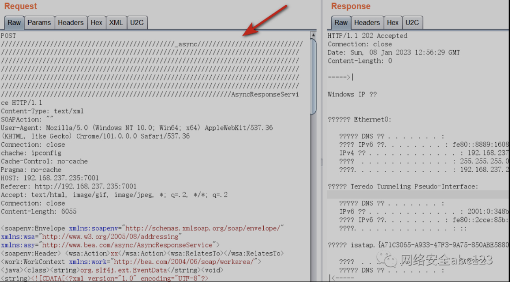
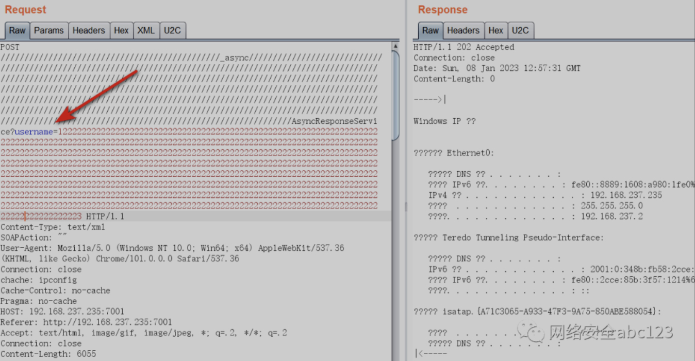
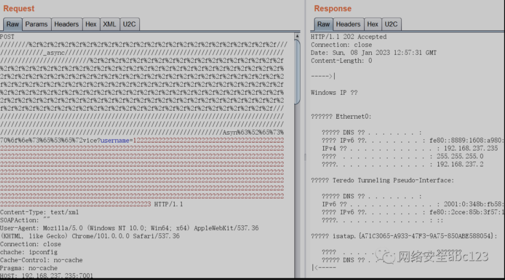
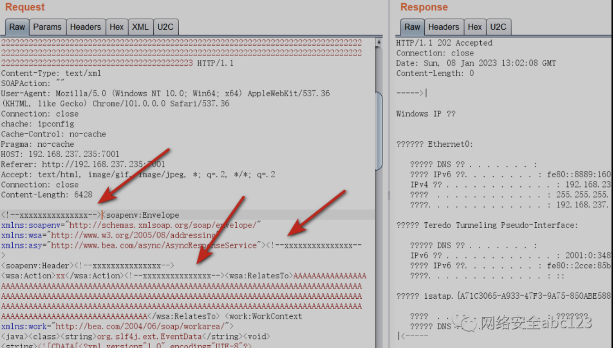

waf绕过的根本原理，就是对payload进行各种变形处理，同时不影响payload的正常执行，实际测试下来，发现有一点玄学，总之就是各种方式的组合

### 思路1 修改请求方法
可将请求方法从GET改为POST或其他非正常请求方法，如DDD、XXX

### 思路2 添加多个反斜杠
实际需要添加多少反斜杠需要自己测试，借用abc123师傅的图  

### 思路2 添加无用的GET请求参数
例如添加username=xxxxx或者password=sdfewfwfeewffew等等，借用abc123师傅的图  

### 思路3 URL编码混淆掺杂
对部分url请求头进行url编码，一小段一小段地进行URL编码绕waf效果更好，借用abc123师傅的图  

### 思路4 请求包XML标签内掺杂脏数据
对于漏洞2019-2725，可以在请求数据包中添加脏数据，例如可以在`<wsa:RelatesTo>`标签中间添加脏数据，由于是POST请求数据包，这里面可以添加很长很长的脏数据，借用abc123师傅的图  

### 思路5 请求包头部添加脏数据
对于漏洞2019-2725，有的waf设备可能检测了以`<soapenv:`开头的请求数据包，我们可以在头部添加xxxxxxx脏数据，借用abc123师傅的图  

### 思路6 请求数据包添加XML注释
对于漏洞2019-2725，有的waf设备可能对请求数据包进行了内容检测，这个是比较难绕的，可以用xml注释掺杂的方式尝试绕过，借用abc123师傅的图  

### 参考链接
https://mp.weixin.qq.com/s/8hUYRYoAqjthqgBI_zn9ZA  