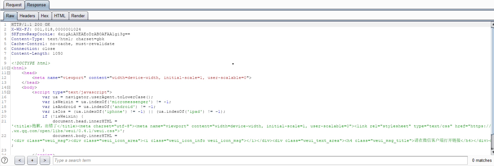
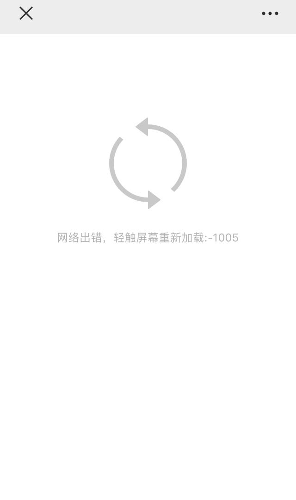
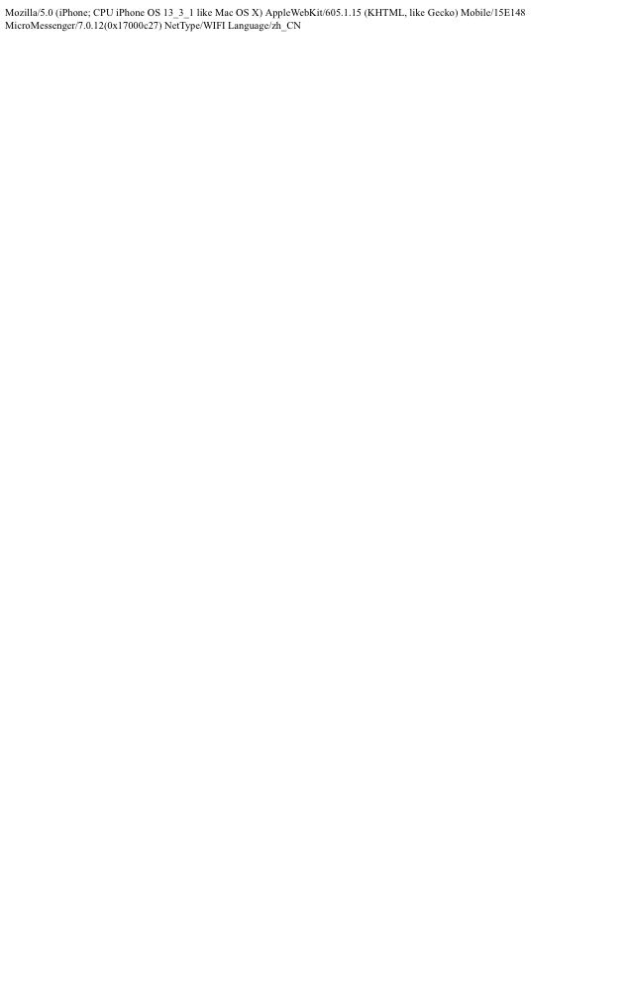
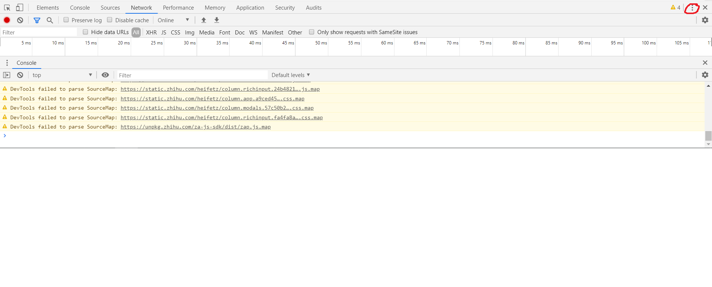

# 0x00 限制原理
通过抓包后返回的页面源码得知  
  
微信服务端通过检查User-Agent中是否包含“micromessenger”来判断请求是否来自微信客户端，以此决定是跳转到目标网站还是提示“请在微信客户端打开链接”，因此我们可以通过获取微信客户端的User-Agent，然后修改浏览器的User-Agent来绕过限制，目前市面上有很多现成的在线工具可用来获取User-Agent，比如http://www.atool9.com/useragent.php

# 0x01 获取User-Agent
但当我通过微信客户端访问上述网址时，却提示出错  
  
怀疑是微信团队对此网站做了限制，不让获取User-Agent，绕过方式是自己写获取的User-Agent的页面，代码如下  
```
<html>
    <body>
        <p id="demo"></p>
        <script>
            var ua = navigator.userAgent;
            document.getElementById("demo").innerHTML = ua;
        </script>
    </body>
</html>
```
手机和电脑处于同一局域网，微信客户端访问上述网页地址，成功获取到User-Agent，如下图  
  
User-Agent如下  
```
Mozilla/5.0 (iPhone; CPU iPhone OS 13_3_1 like Mac OS X) AppleWebKit/605.1.15 (KHTML, like Gecko) Mobile/15E148 MicroMessenger/7.0.12(0x17000c27) NetType/WIFI Language/zh_CN
```
可留做以后使用

# 0x02 为chrome浏览器配置User-Agent
chrome下按F12（或ctrl+shift+i）打开开发者工具，按customize and control devtools即下图中红色圈出来的部分（或ctrl+shift+p）打开命令搜索框  
  
输入network conditions，并选择，如下图  
  
取消勾选automatically，并在User Agent处填入“micromessenger”，不要关闭开发者工具，否则所做的更改会失效，再次访问被微信限制的页面，能够成功访问页面

# 0x03 注意
如果你要打开的网址是以 https://open.weixin.qq.com/ 开头的，那么它使用的是微信开放平台，需要使用你的微信帐户信息。这种方式不适用。
