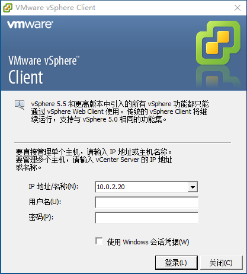

# 0x00 软件介绍
VMware vSphere是一个类似MS Office的套件，它包含VMware ESXi、VMware vCenter Server、VMware vSphere Client  
VMware ESXi：安装在物理机上，负责虚拟化服务  
VMware vCenter Server：通常安装在虚拟机上，负责管理虚拟机  
VMware vSphere Client：通常安装在管理员的笔记本上面，负责连接到VMware vCenter Server来管理虚拟机，或直接管理虚拟机  
通常部署在内网中  
关于它们的下载，可参考这篇文章提到的（使用浏览器会超慢，使用迅雷会快很多）  
具体关于它们都是干什么的，可参考这篇文章https://blog.csdn.net/eastyell/article/details/91581878  
最后给不熟悉VMware vSphere提一句，VMware vSphere Client长这样  

# 0x01 复现环境
#### 使用本地搭建的环境：  
win10 1909 x64 + VMware Workstation 16 Pro + VMware-VMvisor-Installer-7.0.0-15843807.x86_64.iso + VMware-VCSA-all-7.0.0-15952498.iso  
#### 复现版本：  
VMware vCenter Server 7.0.0  
#### 环境搭建过程：  
1、安装VMware ESXi，参考这篇文章，但是我在安装完创建虚拟机时，报错“无法打开虚拟机 CentOS7-x64 的电源。资源不足。 单击此处了解更多详细信息。”，原因未知，先放一边  
2、

# 0x02 利用条件
无

# 0x03 影响版本
JumpServer < v2.6.2  
JumpServer < v2.5.4  
JumpServer < v2.4.5

# 0x04 漏洞复现
攻击环境：kali x64  
chrome下安装扩展：https://chrome.google.com/webstore/detail/websocket-test-client/fgponpodhbmadfljofbimhhlengambbn/related  
使用如下payload：  

如下图，红色圈出的部分即为读取到的远程服务器上的日志内容  

如下图，红色圈出的部分即为服务器上的日志内容  

# 0x05 批量脚本
无

# 0x06 参考链接
https://mp.weixin.qq.com/s/jI3kMCq5FMnNkgvKr1tFMg
